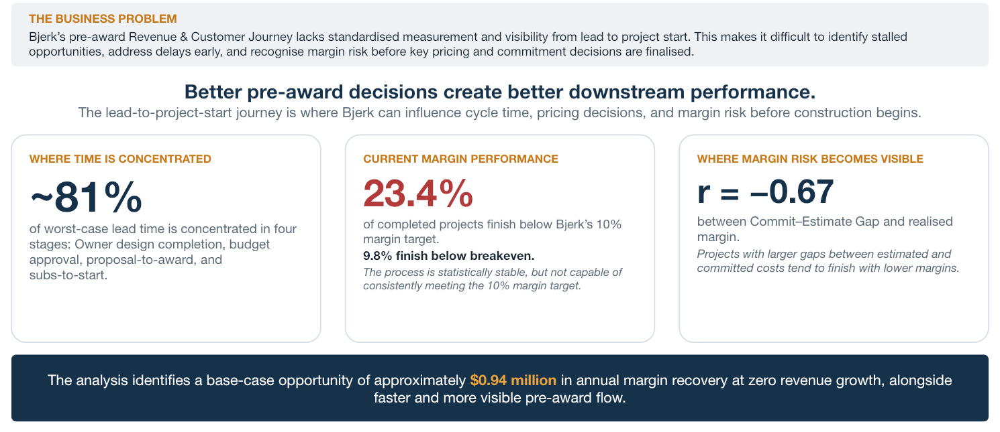
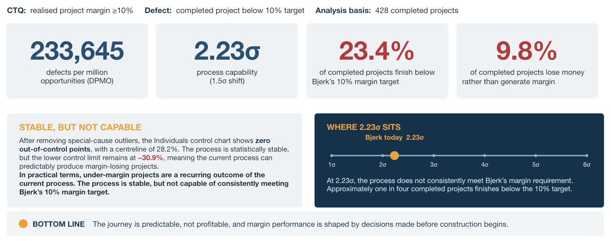
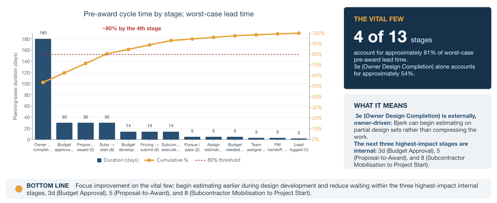
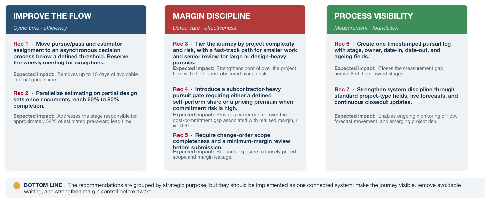
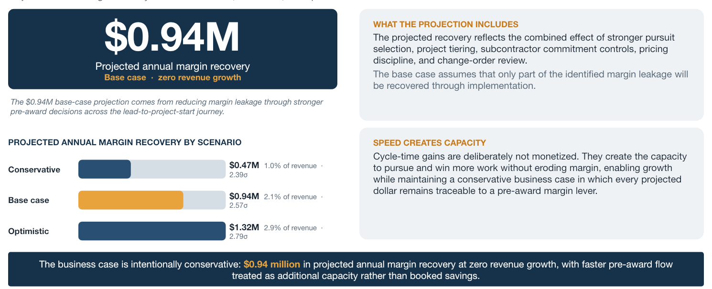

#

  

# Bjerk Builders Revenue & Pre-Award Process Optimization

**Business Analytics Consultant | Lean Six Sigma DMAIC | Process Improvement**

---

## Business Context

Bjerk Builders manages a pre-award journey that begins with lead identification and continues through pursuit decisions, estimating, proposal development, award, project setup, and mobilization.

Leadership could evaluate final project performance, but visibility during the pre-award journey was limited. Eight of nine stages lacked standardized timing, project information was distributed across multiple working practices, and forecasts were not being updated as project conditions changed.

This created an operating blind spot. The business could see which projects underperformed after completion, but it could not consistently identify where opportunities were waiting or where margin risk was emerging before construction began.

## Business Decision

How should Bjerk redesign the pre-award journey to improve visibility and cycle time while strengthening margin control before award?

---

## Executive Summary

Historical operational and completed-project data from 2024 to 2026 was analyzed using the Lean Six Sigma DMAIC framework.

The analysis found that Bjerk's margin process was statistically stable but not capable of consistently meeting the company's 10% margin requirement. Among **428 completed projects**, **23.4%** finished below the margin target and **9.8%** finished below breakeven. Current process capability was approximately **2.23 sigma**.

Cycle-time modeling showed that four of 13 pre-award stages represented approximately **81% of worst-case lead time**. Owner design completion was the largest contributor, but much of that time was externally controlled. The more actionable opportunity was to reduce internal decision queues and begin eligible estimating work earlier during design development.

The strongest verified early margin signal was the commitment-to-estimate gap. It had a **-0.67 Pearson correlation** with realized margin, indicating that larger gaps between estimated and committed costs were associated with lower final margins.

**Recommendation:** Bjerk should establish one measurable pursuit journey, route projects according to risk, remove avoidable internal waiting, and introduce structured pricing and commitment controls before award.

The base-case model estimated approximately **$940,000 in projected annual margin recovery at zero revenue growth**. This represents modeled opportunity, not realized savings.

| Metric | Finding |
|---|---:|
| Completed projects in capability analysis | 428 |
| Projects below 10% margin target | 23.4% |
| Projects below breakeven | 9.8% |
| Current process capability | 2.23 sigma |
| Worst-case lead time concentrated in four stages | Approximately 81% |
| Commitment-to-estimate gap vs. realized margin | r = -0.67 |
| Base-case projected annual margin recovery | $940K |

---

## Executive Overview

The executive view connects three related but distinct management priorities:

- **Process visibility** shows where an opportunity is, how long it has been there, and who owns the next decision.
- **Process flow** addresses avoidable waiting and the sequencing of required pre-award work.
- **Margin control** uses project risk and cost-commitment signals to determine when additional review is required.

---

## Insights Deep Dive

### Margin Performance and Process Capability

**Question:** Is margin underperformance driven by isolated projects, or is it part of normal current-state performance?

Process capability and statistical control analysis were performed on 428 completed projects.

| Measure | Result |
|---|---:|
| Projects below 10% margin target | 23.4% |
| Projects below breakeven | 9.8% |
| Defects per million opportunities | 233,645 |
| Process capability | 2.23 sigma |
| Revised control-chart centerline | 28.2% |
| Revised lower control limit | -30.9% |

After assignable-cause projects were removed through iterative control-chart review, no observations remained outside the revised limits. The process was statistically stable.

**Business interpretation:** Statistical stability did not indicate acceptable performance. It showed that under-margin and margin-losing projects were recurring outputs of the current operating system. Sustainable improvement required changes to the underlying process rather than greater attention only after individual projects underperformed.

### Project Size and Margin Exposure

**Question:** Is financial risk distributed evenly across the portfolio?

Margin defects increased materially with project size.

| Contract value | Projects below the 10% margin floor |
|---|---:|
| Below $100K | 16.4% |
| $100K to $500K | 46.8% |
| $500K to $1M | 53.3% |
| $1M or more | 53.3% |

More than half of completed projects above $500K finished below the margin requirement.

**Business interpretation:** A single pre-award path applies the same process to opportunities with materially different levels of financial and delivery risk. Smaller, lower-risk work can move through a faster path, while larger, design-heavy, or subcontractor-heavy pursuits require stronger review thresholds.

### Pre-Award Cycle Time

**Question:** Where is time concentrated, and which delays can Bjerk influence?

Four stages accounted for approximately 81% of modeled worst-case pre-award lead time:

1. Owner design completion
2. Budget approval
3. Proposal-to-award
4. Subcontractor mobilization to project start

Owner design completion represented approximately 54% of the modeled worst-case journey. However, it was primarily controlled by the owner rather than Bjerk.

Only about 5% of modeled pre-award time was classified as pure non-value-added activity. Approximately 79% consisted of necessary work such as design, approvals, reviews, setup, and mobilization.

**Business interpretation:** The main opportunity is not broad process compression. Required activities should run in parallel where risk allows, while avoidable internal decision queues are removed. Estimating on eligible partial design sets provides a way to respond to externally controlled design time without treating it as internal waste.

### Early Margin-Risk Signal

**Question:** Can margin exposure be identified before final project performance is known?

The strongest verified relationship was between the commitment-to-estimate gap and realized margin.

| Measure | Result |
|---|---:|
| Pearson correlation | -0.67 |
| Explained variance | R-squared = 0.45 |
| Valid paired observations | 411 |

As the gap between estimated and committed costs increased, realized margin tended to decline. Spearman correlation produced nearly the same result, reducing the likelihood that the finding was driven only by outliers.

**Business interpretation:** The relationship is observational and does not establish causation. It does provide a practical signal available at award. A threshold breach can trigger structured review of scope, self-perform assumptions, subcontractor commitments, pricing, and required margin premium.

### Root Causes and Business Risk

Root-cause analysis, the Cause-and-Effect Matrix, and FMEA pointed to the same systemic issues:

- No standardized system of record
- No timestamped pursuit log
- Static forecasting
- Inconsistent pricing and commitment controls
- One process for projects with different risk profiles

| Pre-award area | Priority failure mode | RPN |
|---|---|---:|
| Design completion | Documents delayed or incomplete | 270 |
| Budget approval | Budget rejected or repeatedly revised | 252 |
| Proposal review and award | Proposal misaligned with scope or pricing | 240 |
| Opportunity review | Pursue, assign, or budget decisions delayed | 224 |
| Proposal development | Subcontractor bids incomplete or not comparable | 210 |
| Project start | Work begins before prerequisites are complete | 210 |

**Business interpretation:** The highest risks and the largest modeled delays were concentrated in the same parts of the journey. The recommendations therefore needed to address visibility, decision speed, and financial control as one connected system.

---

## Recommendations

### Recommendation 1: Establish one measurable pursuit journey

**Action:** Create a timestamped pursuit record with stage, owner, date-in, date-out, aging, project type, and forecast status.

**Evidence:** Eight of nine stages lacked standardized timing, and the current data could not show where opportunities were waiting.

**Decision benefit:** Leadership gains one operating view for opportunity status, ownership, aging, exceptions, and future cycle-time measurement.

### Recommendation 2: Remove avoidable internal decision queues

**Action:** Move routine pursue/pass and estimator-assignment decisions to an asynchronous process below a defined threshold. Reserve meetings for exceptions.

**Evidence:** The current journey included up to 15 days of avoidable internal queue time.

**Decision benefit:** Routine opportunities move faster without removing leadership oversight from higher-risk decisions.

### Recommendation 3: Pilot estimating on partial design sets

**Action:** Begin eligible estimating work once design documents reach an approved level of completion, supported by eligibility rules and revision-risk tracking.

**Evidence:** Owner design completion represented approximately 54% of modeled worst-case pre-award lead time.

**Decision benefit:** Required estimating work can begin earlier without assuming that externally controlled design time can be eliminated.

### Recommendation 4: Tier the journey by project risk

**Action:** Create differentiated paths based on contract value, complexity, design maturity, subcontractor exposure, and scope uncertainty.

**Evidence:** More than half of completed projects above $500K finished below the margin target.

**Decision benefit:** Lower-risk work can move efficiently while leadership attention is concentrated where financial exposure is highest.

### Recommendation 5: Introduce pre-award margin gates

**Action:** Require structured review for subcontractor-heavy pursuits, material commitment-to-estimate gaps, incomplete change-order scope, and proposed margins outside tolerance.

**Evidence:** The commitment-to-estimate gap had a -0.67 relationship with realized margin, and change-order scope completeness was a priority defect driver.

**Decision benefit:** Projects can be repriced, mitigated, escalated, or declined before the organization accepts avoidable exposure.

### Recommendation 6: Strengthen forecast and closeout discipline

**Action:** Standardize project-type fields, update cost-at-completion forecasts as conditions change, and use completed-project outcomes to improve future estimating decisions.

**Evidence:** All 534 forecastable projects retained the original estimate as cost at completion.

**Decision benefit:** Forecasting becomes a live management control rather than a static project field.

---

## Expected Business Impact

The financial model estimated the portion of historical margin leakage that stronger pre-award decisions could reasonably recover. Capture assumptions were applied by defect driver and capped at 70%.

| Scenario | Projected annual margin recovery | Share of revenue | Implied capability |
|---|---:|---:|---:|
| Conservative | $470K | 1.0% | 2.39 sigma |
| Base case | $940K | 2.1% | 2.57 sigma |
| Optimistic | $1.32M | 2.9% | 2.79 sigma |

All scenarios assume zero revenue growth. Cycle-time benefits were excluded from the annual margin projection and treated as potential additional capacity rather than booked savings.

The $940K base case is a projected opportunity, not realized savings, committed value, or guaranteed performance.

---

## Implementation Roadmap

### Wave 1: Management foundation | Weeks 1 to 12

- Launch the timestamped pursuit log.
- Establish asynchronous decision rules and exception thresholds.
- Standardize project-type and forecast updates.
- Run a controlled partial-design estimating pilot.

### Wave 2: Margin controls | One to two quarters

- Introduce the subcontractor-heavy pursuit gate.
- Add change-order scope and minimum-margin review.

### Wave 3: Structural scale-up | Two or more quarters

- Expand partial-design estimating where the pilot demonstrates value.
- Implement differentiated paths based on project complexity and risk.

The sequence establishes measurement before broader redesign so adoption, exceptions, cycle time, and financial outcomes can be evaluated against a verified baseline.

---

## Measurement and Control

| Measure | Management purpose | Review cadence |
|---|---|---|
| Stage aging | Identify stalled opportunities and ownership gaps | Weekly |
| Decision turnaround | Measure internal queue reduction | Weekly |
| Lead-to-award time | Track overall pre-award flow | Monthly |
| Commitment-to-estimate ratio | Flag early margin exposure | At award and monthly |
| Forecast movement | Confirm forecasting functions as a live control | Monthly |
| Margin defect rate | Verify financial performance improvement | Monthly and quarterly |
| Gate compliance | Measure adoption of required controls | Monthly |
| Pilot rework rate | Test whether earlier estimating creates unacceptable rework | Per pilot and monthly |

---

## Data and Method

**Data scope:** Historical operational and completed-project data from 2024 to 2026.

**Completed-project capability analysis:** 428 projects.

**Valid correlation pairs:** 411 projects for the commitment-to-estimate gap analysis.

**Methods:** Lean Six Sigma DMAIC, current-state process mapping, CTQ development, measurement assessment, Pareto analysis, value-added analysis, process capability, statistical process control, correlation, hypothesis testing, Fishbone analysis, Cause-and-Effect Matrix, FMEA, prioritization, scenario modeling, and implementation roadmapping.

---

## Limitations

- Historical timestamps were unavailable for eight of nine pre-award stages, so stage-level cycle time used planning-based duration ranges.
- Cycle-time projections are modeled estimates and require validation through the proposed pursuit log and pilot.
- Statistical relationships are observational and do not establish causation.
- Financial scenarios depend on implementation and capped capture assumptions.
- Projected margin recovery is not realized or guaranteed savings.
- The public portfolio excludes raw data, identifiable project records, internal working files, and the complete client presentation.

---

## Key Takeaways

- Bjerk's margin process was stable but not capable of consistently meeting the 10% requirement.
- Margin exposure increased materially with project size.
- Four stages accounted for approximately 81% of modeled worst-case pre-award lead time.
- The commitment-to-estimate gap provided a practical early margin-risk signal.
- Visibility, flow, and margin discipline must operate as one management system.
- The base case identified $940K in projected annual margin recovery at zero revenue growth.

---

## Skills Demonstrated

- Translating an operational problem into measurable business decisions
- Assessing data quality and separating actual findings from planning assumptions
- Applying process capability and statistical control to financial outcomes
- Identifying cycle-time concentration through Pareto analysis
- Connecting project characteristics and cost commitments to margin exposure
- Prioritizing root causes through Cause-and-Effect analysis and FMEA
- Converting analytical findings into operating controls and decision gates
- Building a scenario-based business case and phased implementation roadmap
- Communicating limitations, projected value, and executive recommendations

